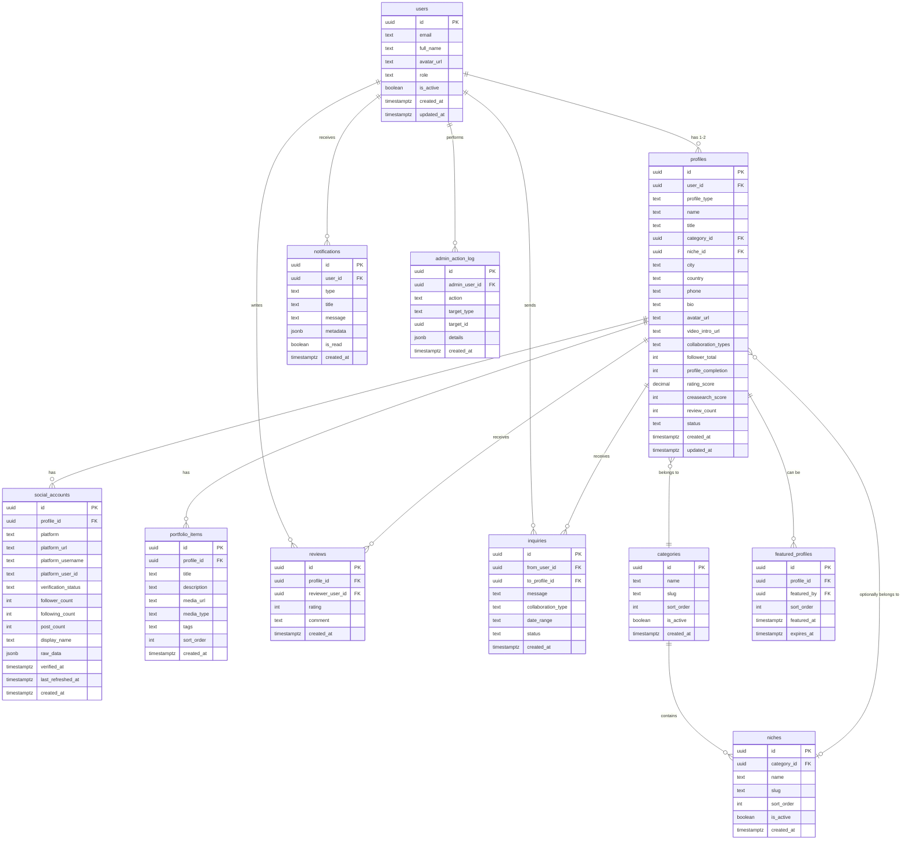

# Database Redesign Plan — Creasearch

> Complete restructuring of the Supabase PostgreSQL database for scalability, normalization, and future-readiness.

---

## Current Problems

| Issue | Detail |
|-------|--------|
| Monolithic `profiles` table | ~25 columns mixing identity, location, social verification, scoring |
| Unstructured `social_links` JSONB | URLs, verification status, subscriber counts all in one JSON blob |
| No app-level `users` table | Relies entirely on Supabase `auth.users` |
| Duplicate location fields | Legacy `location` + separate `city`/`country` |
| Freetext `industry`/`niche` | Not normalized, no predefined categories |
| `gigs_completed` field | No backing system, meaningless counter |
| No notifications system | Users have no way to know about status changes |
| No admin audit trail | No record of admin actions (approve/reject/delete) |
| `verified_socials` array | Redundant with data inside `social_links` JSONB |

---

## Design Decisions

1. **Users can have TWO profiles** — one as Creator, one as Organization/Brand
2. **Industries & Niches** — predefined, admin-managed categories (dropdown)
3. **Social accounts** — normalized table, expandable to any platform
4. **One-way inquiries** — keep simple, no conversation threading
5. **No gigs/collaboration tracking** — removed entirely
6. **Payments** — future-ready with reserved table space, not implemented now
7. **Notifications** — in-app notification system
8. **Admin features** — action logs, featured profiles, category management

---

## New Schema Overview



---

## Phase 1: Core Foundation

> New `users`, `categories`, `niches` tables + redesigned `profiles` table + new `social_accounts` table.

### 1.1 — `users` table (NEW)

Syncs with Supabase `auth.users` on signup.

```sql
CREATE TABLE IF NOT EXISTS users (
  id UUID PRIMARY KEY REFERENCES auth.users(id) ON DELETE CASCADE,
  email TEXT NOT NULL UNIQUE,
  full_name TEXT,
  avatar_url TEXT,
  role TEXT DEFAULT 'user' CHECK (role IN ('user', 'admin')),
  is_active BOOLEAN DEFAULT true,
  created_at TIMESTAMPTZ DEFAULT NOW(),
  updated_at TIMESTAMPTZ DEFAULT NOW()
);

CREATE INDEX idx_users_email ON users(email);
CREATE INDEX idx_users_role ON users(role);
```

### 1.2 — `categories` table (NEW)

Predefined industries managed by admin.

```sql
CREATE TABLE IF NOT EXISTS categories (
  id UUID PRIMARY KEY DEFAULT uuid_generate_v4(),
  name TEXT NOT NULL UNIQUE,
  slug TEXT NOT NULL UNIQUE,
  sort_order INTEGER DEFAULT 0,
  is_active BOOLEAN DEFAULT true,
  created_at TIMESTAMPTZ DEFAULT NOW()
);

-- Seed data
INSERT INTO categories (name, slug, sort_order) VALUES
  ('Technology', 'technology', 1),
  ('Fashion & Beauty', 'fashion-beauty', 2),
  ('Food & Cooking', 'food-cooking', 3),
  ('Gaming', 'gaming', 4),
  ('Education & Learning', 'education-learning', 5),
  ('Entertainment & Comedy', 'entertainment-comedy', 6),
  ('Health & Fitness', 'health-fitness', 7),
  ('Travel & Adventure', 'travel-adventure', 8),
  ('Music & Dance', 'music-dance', 9),
  ('Photography & Videography', 'photography-videography', 10),
  ('Business & Finance', 'business-finance', 11),
  ('Lifestyle & Vlogs', 'lifestyle-vlogs', 12),
  ('Sports & Athletics', 'sports-athletics', 13),
  ('Auto & Vehicles', 'auto-vehicles', 14),
  ('Art & Design', 'art-design', 15),
  ('Parenting & Family', 'parenting-family', 16),
  ('Motivation & Self-Help', 'motivation-self-help', 17),
  ('News & Current Affairs', 'news-current-affairs', 18),
  ('Real Estate & Property', 'real-estate-property', 19),
  ('DIY & Crafts', 'diy-crafts', 20),
  ('Pets & Animals', 'pets-animals', 21),
  ('Islamic & Religious Content', 'islamic-religious', 22),
  ('Reviews & Unboxing', 'reviews-unboxing', 23),
  ('Digital Marketing & Social Media', 'digital-marketing', 24),
  ('Freelancing & Career', 'freelancing-career', 25),
  ('Other', 'other', 99);
```

### 1.3 — `niches` table (NEW)

Sub-categories linked to a parent category.

```sql
CREATE TABLE IF NOT EXISTS niches (
  id UUID PRIMARY KEY DEFAULT uuid_generate_v4(),
  category_id UUID NOT NULL REFERENCES categories(id) ON DELETE CASCADE,
  name TEXT NOT NULL,
  slug TEXT NOT NULL,
  sort_order INTEGER DEFAULT 0,
  is_active BOOLEAN DEFAULT true,
  created_at TIMESTAMPTZ DEFAULT NOW(),
  UNIQUE(category_id, slug)
);

CREATE INDEX idx_niches_category ON niches(category_id);

-- Technology
INSERT INTO niches (category_id, name, slug, sort_order)
SELECT id, 'Software Reviews', 'software-reviews', 1 FROM categories WHERE slug = 'technology'
UNION ALL SELECT id, 'AI & Machine Learning', 'ai-ml', 2 FROM categories WHERE slug = 'technology'
UNION ALL SELECT id, 'Web Development', 'web-development', 3 FROM categories WHERE slug = 'technology'
UNION ALL SELECT id, 'Mobile Apps', 'mobile-apps', 4 FROM categories WHERE slug = 'technology'
UNION ALL SELECT id, 'Gadget Reviews', 'gadget-reviews', 5 FROM categories WHERE slug = 'technology'
UNION ALL SELECT id, 'Coding Tutorials', 'coding-tutorials', 6 FROM categories WHERE slug = 'technology'
UNION ALL SELECT id, 'Cybersecurity', 'cybersecurity', 7 FROM categories WHERE slug = 'technology';

-- Fashion & Beauty
INSERT INTO niches (category_id, name, slug, sort_order)
SELECT id, 'Makeup & Skincare', 'makeup-skincare', 1 FROM categories WHERE slug = 'fashion-beauty'
UNION ALL SELECT id, 'Street Fashion', 'street-fashion', 2 FROM categories WHERE slug = 'fashion-beauty'
UNION ALL SELECT id, 'Luxury Brands', 'luxury-brands', 3 FROM categories WHERE slug = 'fashion-beauty'
UNION ALL SELECT id, 'Hijab & Modest Fashion', 'hijab-modest-fashion', 4 FROM categories WHERE slug = 'fashion-beauty'
UNION ALL SELECT id, 'Nail Art', 'nail-art', 5 FROM categories WHERE slug = 'fashion-beauty'
UNION ALL SELECT id, 'Hair Care & Styling', 'hair-care-styling', 6 FROM categories WHERE slug = 'fashion-beauty'
UNION ALL SELECT id, 'Men''s Grooming', 'mens-grooming', 7 FROM categories WHERE slug = 'fashion-beauty';

-- Food & Cooking
INSERT INTO niches (category_id, name, slug, sort_order)
SELECT id, 'Pakistani Recipes', 'pakistani-recipes', 1 FROM categories WHERE slug = 'food-cooking'
UNION ALL SELECT id, 'Street Food Reviews', 'street-food-reviews', 2 FROM categories WHERE slug = 'food-cooking'
UNION ALL SELECT id, 'Baking & Desserts', 'baking-desserts', 3 FROM categories WHERE slug = 'food-cooking'
UNION ALL SELECT id, 'Healthy Eating', 'healthy-eating', 4 FROM categories WHERE slug = 'food-cooking'
UNION ALL SELECT id, 'Restaurant Reviews', 'restaurant-reviews', 5 FROM categories WHERE slug = 'food-cooking'
UNION ALL SELECT id, 'Food Photography', 'food-photography', 6 FROM categories WHERE slug = 'food-cooking';

-- Gaming
INSERT INTO niches (category_id, name, slug, sort_order)
SELECT id, 'Mobile Gaming', 'mobile-gaming', 1 FROM categories WHERE slug = 'gaming'
UNION ALL SELECT id, 'PC Gaming', 'pc-gaming', 2 FROM categories WHERE slug = 'gaming'
UNION ALL SELECT id, 'Console Gaming', 'console-gaming', 3 FROM categories WHERE slug = 'gaming'
UNION ALL SELECT id, 'Game Reviews', 'game-reviews', 4 FROM categories WHERE slug = 'gaming'
UNION ALL SELECT id, 'Esports', 'esports', 5 FROM categories WHERE slug = 'gaming'
UNION ALL SELECT id, 'Streaming & Let''s Play', 'streaming-lets-play', 6 FROM categories WHERE slug = 'gaming';

-- Education & Learning
INSERT INTO niches (category_id, name, slug, sort_order)
SELECT id, 'Study Tips & Hacks', 'study-tips', 1 FROM categories WHERE slug = 'education-learning'
UNION ALL SELECT id, 'Language Learning', 'language-learning', 2 FROM categories WHERE slug = 'education-learning'
UNION ALL SELECT id, 'Science & Math', 'science-math', 3 FROM categories WHERE slug = 'education-learning'
UNION ALL SELECT id, 'Online Courses', 'online-courses', 4 FROM categories WHERE slug = 'education-learning'
UNION ALL SELECT id, 'Board Exam Prep', 'board-exam-prep', 5 FROM categories WHERE slug = 'education-learning'
UNION ALL SELECT id, 'University Life', 'university-life', 6 FROM categories WHERE slug = 'education-learning';

-- Entertainment & Comedy
INSERT INTO niches (category_id, name, slug, sort_order)
SELECT id, 'Comedy Sketches', 'comedy-sketches', 1 FROM categories WHERE slug = 'entertainment-comedy'
UNION ALL SELECT id, 'Roasting & Commentary', 'roasting-commentary', 2 FROM categories WHERE slug = 'entertainment-comedy'
UNION ALL SELECT id, 'Drama & Film Reviews', 'drama-film-reviews', 3 FROM categories WHERE slug = 'entertainment-comedy'
UNION ALL SELECT id, 'Memes & Trending', 'memes-trending', 4 FROM categories WHERE slug = 'entertainment-comedy'
UNION ALL SELECT id, 'Podcasting', 'podcasting', 5 FROM categories WHERE slug = 'entertainment-comedy'
UNION ALL SELECT id, 'Celebrity News', 'celebrity-news', 6 FROM categories WHERE slug = 'entertainment-comedy';

-- Health & Fitness
INSERT INTO niches (category_id, name, slug, sort_order)
SELECT id, 'Gym & Workout', 'gym-workout', 1 FROM categories WHERE slug = 'health-fitness'
UNION ALL SELECT id, 'Yoga & Meditation', 'yoga-meditation', 2 FROM categories WHERE slug = 'health-fitness'
UNION ALL SELECT id, 'Nutrition & Diet', 'nutrition-diet', 3 FROM categories WHERE slug = 'health-fitness'
UNION ALL SELECT id, 'Mental Health', 'mental-health', 4 FROM categories WHERE slug = 'health-fitness'
UNION ALL SELECT id, 'Home Workouts', 'home-workouts', 5 FROM categories WHERE slug = 'health-fitness'
UNION ALL SELECT id, 'Weight Loss', 'weight-loss', 6 FROM categories WHERE slug = 'health-fitness';

-- Travel & Adventure
INSERT INTO niches (category_id, name, slug, sort_order)
SELECT id, 'Pakistan Tourism', 'pakistan-tourism', 1 FROM categories WHERE slug = 'travel-adventure'
UNION ALL SELECT id, 'International Travel', 'international-travel', 2 FROM categories WHERE slug = 'travel-adventure'
UNION ALL SELECT id, 'Budget Travel', 'budget-travel', 3 FROM categories WHERE slug = 'travel-adventure'
UNION ALL SELECT id, 'Hiking & Trekking', 'hiking-trekking', 4 FROM categories WHERE slug = 'travel-adventure'
UNION ALL SELECT id, 'Hotel & Resort Reviews', 'hotel-resort-reviews', 5 FROM categories WHERE slug = 'travel-adventure'
UNION ALL SELECT id, 'Road Trips', 'road-trips', 6 FROM categories WHERE slug = 'travel-adventure';

-- Music & Dance
INSERT INTO niches (category_id, name, slug, sort_order)
SELECT id, 'Singing & Vocals', 'singing-vocals', 1 FROM categories WHERE slug = 'music-dance'
UNION ALL SELECT id, 'Music Production', 'music-production', 2 FROM categories WHERE slug = 'music-dance'
UNION ALL SELECT id, 'Instrument Tutorials', 'instrument-tutorials', 3 FROM categories WHERE slug = 'music-dance'
UNION ALL SELECT id, 'Dance Choreography', 'dance-choreography', 4 FROM categories WHERE slug = 'music-dance'
UNION ALL SELECT id, 'Music Reviews', 'music-reviews', 5 FROM categories WHERE slug = 'music-dance'
UNION ALL SELECT id, 'DJ & Remixes', 'dj-remixes', 6 FROM categories WHERE slug = 'music-dance';

-- Photography & Videography
INSERT INTO niches (category_id, name, slug, sort_order)
SELECT id, 'Portrait Photography', 'portrait-photography', 1 FROM categories WHERE slug = 'photography-videography'
UNION ALL SELECT id, 'Wedding Photography', 'wedding-photography', 2 FROM categories WHERE slug = 'photography-videography'
UNION ALL SELECT id, 'Drone Videography', 'drone-videography', 3 FROM categories WHERE slug = 'photography-videography'
UNION ALL SELECT id, 'Editing Tutorials', 'editing-tutorials', 4 FROM categories WHERE slug = 'photography-videography'
UNION ALL SELECT id, 'Filmmaking', 'filmmaking', 5 FROM categories WHERE slug = 'photography-videography'
UNION ALL SELECT id, 'Camera Reviews', 'camera-reviews', 6 FROM categories WHERE slug = 'photography-videography';

-- Business & Finance
INSERT INTO niches (category_id, name, slug, sort_order)
SELECT id, 'Investing & Stock Market', 'investing-stock-market', 1 FROM categories WHERE slug = 'business-finance'
UNION ALL SELECT id, 'Cryptocurrency', 'cryptocurrency', 2 FROM categories WHERE slug = 'business-finance'
UNION ALL SELECT id, 'Entrepreneurship', 'entrepreneurship', 3 FROM categories WHERE slug = 'business-finance'
UNION ALL SELECT id, 'Personal Finance', 'personal-finance', 4 FROM categories WHERE slug = 'business-finance'
UNION ALL SELECT id, 'E-Commerce & Dropshipping', 'ecommerce-dropshipping', 5 FROM categories WHERE slug = 'business-finance'
UNION ALL SELECT id, 'Startups', 'startups', 6 FROM categories WHERE slug = 'business-finance';

-- Lifestyle & Vlogs
INSERT INTO niches (category_id, name, slug, sort_order)
SELECT id, 'Daily Vlogs', 'daily-vlogs', 1 FROM categories WHERE slug = 'lifestyle-vlogs'
UNION ALL SELECT id, 'Minimalism', 'minimalism', 2 FROM categories WHERE slug = 'lifestyle-vlogs'
UNION ALL SELECT id, 'Home Decor', 'home-decor', 3 FROM categories WHERE slug = 'lifestyle-vlogs'
UNION ALL SELECT id, 'Productivity', 'productivity', 4 FROM categories WHERE slug = 'lifestyle-vlogs'
UNION ALL SELECT id, 'Day In My Life', 'day-in-my-life', 5 FROM categories WHERE slug = 'lifestyle-vlogs'
UNION ALL SELECT id, 'Couple & Relationship', 'couple-relationship', 6 FROM categories WHERE slug = 'lifestyle-vlogs';

-- Sports & Athletics
INSERT INTO niches (category_id, name, slug, sort_order)
SELECT id, 'Cricket', 'cricket', 1 FROM categories WHERE slug = 'sports-athletics'
UNION ALL SELECT id, 'Football', 'football', 2 FROM categories WHERE slug = 'sports-athletics'
UNION ALL SELECT id, 'Bodybuilding', 'bodybuilding', 3 FROM categories WHERE slug = 'sports-athletics'
UNION ALL SELECT id, 'MMA & Boxing', 'mma-boxing', 4 FROM categories WHERE slug = 'sports-athletics'
UNION ALL SELECT id, 'Sports Commentary', 'sports-commentary', 5 FROM categories WHERE slug = 'sports-athletics'
UNION ALL SELECT id, 'Outdoor Sports', 'outdoor-sports', 6 FROM categories WHERE slug = 'sports-athletics';

-- Auto & Vehicles
INSERT INTO niches (category_id, name, slug, sort_order)
SELECT id, 'Car Reviews', 'car-reviews', 1 FROM categories WHERE slug = 'auto-vehicles'
UNION ALL SELECT id, 'Bike & Motorcycle', 'bike-motorcycle', 2 FROM categories WHERE slug = 'auto-vehicles'
UNION ALL SELECT id, 'Auto Detailing', 'auto-detailing', 3 FROM categories WHERE slug = 'auto-vehicles'
UNION ALL SELECT id, 'Modified Cars', 'modified-cars', 4 FROM categories WHERE slug = 'auto-vehicles'
UNION ALL SELECT id, 'Electric Vehicles', 'electric-vehicles', 5 FROM categories WHERE slug = 'auto-vehicles';

-- Art & Design
INSERT INTO niches (category_id, name, slug, sort_order)
SELECT id, 'Digital Art', 'digital-art', 1 FROM categories WHERE slug = 'art-design'
UNION ALL SELECT id, 'Graphic Design', 'graphic-design', 2 FROM categories WHERE slug = 'art-design'
UNION ALL SELECT id, 'UI/UX Design', 'ui-ux-design', 3 FROM categories WHERE slug = 'art-design'
UNION ALL SELECT id, 'Calligraphy', 'calligraphy', 4 FROM categories WHERE slug = 'art-design'
UNION ALL SELECT id, 'Painting & Drawing', 'painting-drawing', 5 FROM categories WHERE slug = 'art-design'
UNION ALL SELECT id, 'Animation & Motion', 'animation-motion', 6 FROM categories WHERE slug = 'art-design';

-- Parenting & Family
INSERT INTO niches (category_id, name, slug, sort_order)
SELECT id, 'Mom Life', 'mom-life', 1 FROM categories WHERE slug = 'parenting-family'
UNION ALL SELECT id, 'Baby Care', 'baby-care', 2 FROM categories WHERE slug = 'parenting-family'
UNION ALL SELECT id, 'Kids Activities', 'kids-activities', 3 FROM categories WHERE slug = 'parenting-family'
UNION ALL SELECT id, 'Family Vlogs', 'family-vlogs', 4 FROM categories WHERE slug = 'parenting-family'
UNION ALL SELECT id, 'Pregnancy & Maternity', 'pregnancy-maternity', 5 FROM categories WHERE slug = 'parenting-family';

-- Motivation & Self-Help
INSERT INTO niches (category_id, name, slug, sort_order)
SELECT id, 'Personal Development', 'personal-development', 1 FROM categories WHERE slug = 'motivation-self-help'
UNION ALL SELECT id, 'Public Speaking', 'public-speaking', 2 FROM categories WHERE slug = 'motivation-self-help'
UNION ALL SELECT id, 'Life Coaching', 'life-coaching', 3 FROM categories WHERE slug = 'motivation-self-help'
UNION ALL SELECT id, 'Book Reviews', 'book-reviews', 4 FROM categories WHERE slug = 'motivation-self-help'
UNION ALL SELECT id, 'Success Stories', 'success-stories', 5 FROM categories WHERE slug = 'motivation-self-help';

-- News & Current Affairs
INSERT INTO niches (category_id, name, slug, sort_order)
SELECT id, 'Political Commentary', 'political-commentary', 1 FROM categories WHERE slug = 'news-current-affairs'
UNION ALL SELECT id, 'Tech News', 'tech-news', 2 FROM categories WHERE slug = 'news-current-affairs'
UNION ALL SELECT id, 'Business News', 'business-news', 3 FROM categories WHERE slug = 'news-current-affairs'
UNION ALL SELECT id, 'Social Issues', 'social-issues', 4 FROM categories WHERE slug = 'news-current-affairs'
UNION ALL SELECT id, 'Investigative Journalism', 'investigative-journalism', 5 FROM categories WHERE slug = 'news-current-affairs';

-- Real Estate & Property
INSERT INTO niches (category_id, name, slug, sort_order)
SELECT id, 'Property Vlogs', 'property-vlogs', 1 FROM categories WHERE slug = 'real-estate-property'
UNION ALL SELECT id, 'Home Tours', 'home-tours', 2 FROM categories WHERE slug = 'real-estate-property'
UNION ALL SELECT id, 'Investment Tips', 'investment-tips', 3 FROM categories WHERE slug = 'real-estate-property'
UNION ALL SELECT id, 'Construction & Architecture', 'construction-architecture', 4 FROM categories WHERE slug = 'real-estate-property';

-- DIY & Crafts
INSERT INTO niches (category_id, name, slug, sort_order)
SELECT id, 'Home DIY Projects', 'home-diy-projects', 1 FROM categories WHERE slug = 'diy-crafts'
UNION ALL SELECT id, 'Sewing & Stitching', 'sewing-stitching', 2 FROM categories WHERE slug = 'diy-crafts'
UNION ALL SELECT id, 'Woodworking', 'woodworking', 3 FROM categories WHERE slug = 'diy-crafts'
UNION ALL SELECT id, 'Paper Crafts', 'paper-crafts', 4 FROM categories WHERE slug = 'diy-crafts'
UNION ALL SELECT id, 'Upcycling & Recycling', 'upcycling-recycling', 5 FROM categories WHERE slug = 'diy-crafts';

-- Pets & Animals
INSERT INTO niches (category_id, name, slug, sort_order)
SELECT id, 'Dog Content', 'dog-content', 1 FROM categories WHERE slug = 'pets-animals'
UNION ALL SELECT id, 'Cat Content', 'cat-content', 2 FROM categories WHERE slug = 'pets-animals'
UNION ALL SELECT id, 'Bird Keeping', 'bird-keeping', 3 FROM categories WHERE slug = 'pets-animals'
UNION ALL SELECT id, 'Pet Care Tips', 'pet-care-tips', 4 FROM categories WHERE slug = 'pets-animals'
UNION ALL SELECT id, 'Aquarium & Fish', 'aquarium-fish', 5 FROM categories WHERE slug = 'pets-animals';

-- Islamic & Religious Content
INSERT INTO niches (category_id, name, slug, sort_order)
SELECT id, 'Quran Recitation', 'quran-recitation', 1 FROM categories WHERE slug = 'islamic-religious'
UNION ALL SELECT id, 'Islamic Lectures', 'islamic-lectures', 2 FROM categories WHERE slug = 'islamic-religious'
UNION ALL SELECT id, 'Deen & Lifestyle', 'deen-lifestyle', 3 FROM categories WHERE slug = 'islamic-religious'
UNION ALL SELECT id, 'Nasheed & Hamd', 'nasheed-hamd', 4 FROM categories WHERE slug = 'islamic-religious'
UNION ALL SELECT id, 'Ramadan Content', 'ramadan-content', 5 FROM categories WHERE slug = 'islamic-religious';

-- Reviews & Unboxing
INSERT INTO niches (category_id, name, slug, sort_order)
SELECT id, 'Product Unboxing', 'product-unboxing', 1 FROM categories WHERE slug = 'reviews-unboxing'
UNION ALL SELECT id, 'Tech Unboxing', 'tech-unboxing', 2 FROM categories WHERE slug = 'reviews-unboxing'
UNION ALL SELECT id, 'Honest Reviews', 'honest-reviews', 3 FROM categories WHERE slug = 'reviews-unboxing'
UNION ALL SELECT id, 'Comparison Videos', 'comparison-videos', 4 FROM categories WHERE slug = 'reviews-unboxing'
UNION ALL SELECT id, 'Subscription Box Reviews', 'subscription-box', 5 FROM categories WHERE slug = 'reviews-unboxing';

-- Digital Marketing & Social Media
INSERT INTO niches (category_id, name, slug, sort_order)
SELECT id, 'Instagram Growth', 'instagram-growth', 1 FROM categories WHERE slug = 'digital-marketing'
UNION ALL SELECT id, 'YouTube Strategy', 'youtube-strategy', 2 FROM categories WHERE slug = 'digital-marketing'
UNION ALL SELECT id, 'SEO & Content Marketing', 'seo-content-marketing', 3 FROM categories WHERE slug = 'digital-marketing'
UNION ALL SELECT id, 'Email Marketing', 'email-marketing', 4 FROM categories WHERE slug = 'digital-marketing'
UNION ALL SELECT id, 'TikTok Growth', 'tiktok-growth', 5 FROM categories WHERE slug = 'digital-marketing'
UNION ALL SELECT id, 'Brand Collaborations', 'brand-collaborations', 6 FROM categories WHERE slug = 'digital-marketing';

-- Freelancing & Career
INSERT INTO niches (category_id, name, slug, sort_order)
SELECT id, 'Upwork & Fiverr Tips', 'upwork-fiverr-tips', 1 FROM categories WHERE slug = 'freelancing-career'
UNION ALL SELECT id, 'Resume & Interview', 'resume-interview', 2 FROM categories WHERE slug = 'freelancing-career'
UNION ALL SELECT id, 'Remote Work', 'remote-work', 3 FROM categories WHERE slug = 'freelancing-career'
UNION ALL SELECT id, 'Side Hustle Ideas', 'side-hustle-ideas', 4 FROM categories WHERE slug = 'freelancing-career'
UNION ALL SELECT id, 'Skill Development', 'skill-development', 5 FROM categories WHERE slug = 'freelancing-career';
```

### 1.4 — `profiles` table (REDESIGNED)

```sql
-- Drop old columns, add new ones via migration
ALTER TABLE profiles
  ADD COLUMN IF NOT EXISTS profile_type TEXT DEFAULT 'creator'
    CHECK (profile_type IN ('creator', 'organization')),
  ADD COLUMN IF NOT EXISTS category_id UUID REFERENCES categories(id),
  ADD COLUMN IF NOT EXISTS niche_id UUID REFERENCES niches(id),
  ADD COLUMN IF NOT EXISTS review_count INTEGER DEFAULT 0;

-- Remove deprecated columns
ALTER TABLE profiles
  DROP COLUMN IF EXISTS role,
  DROP COLUMN IF EXISTS location,
  DROP COLUMN IF EXISTS social_links,
  DROP COLUMN IF EXISTS verified_socials,
  DROP COLUMN IF EXISTS gigs_completed,
  DROP COLUMN IF EXISTS follower_total;

-- Add computed follower_total as a stored column (updated by trigger)
ALTER TABLE profiles
  ADD COLUMN IF NOT EXISTS follower_total INTEGER DEFAULT 0;

-- Update FK from auth.users to users
-- (profiles.user_id already references auth.users which is same as users.id)

-- Allow one creator + one org profile per user
CREATE UNIQUE INDEX IF NOT EXISTS idx_profiles_user_type
  ON profiles(user_id, profile_type);

-- Update existing indexes
CREATE INDEX IF NOT EXISTS idx_profiles_category ON profiles(category_id);
CREATE INDEX IF NOT EXISTS idx_profiles_niche ON profiles(niche_id);
CREATE INDEX IF NOT EXISTS idx_profiles_type ON profiles(profile_type);
CREATE INDEX IF NOT EXISTS idx_profiles_score ON profiles(creasearch_score DESC);
CREATE INDEX IF NOT EXISTS idx_profiles_rating ON profiles(rating_score DESC);
```

### 1.5 — `social_accounts` table (NEW)

Replaces `social_links` JSONB. One row per platform per profile.

```sql
CREATE TABLE IF NOT EXISTS social_accounts (
  id UUID PRIMARY KEY DEFAULT uuid_generate_v4(),
  profile_id UUID NOT NULL REFERENCES profiles(id) ON DELETE CASCADE,
  platform TEXT NOT NULL CHECK (platform IN (
    'youtube', 'instagram', 'tiktok', 'twitter', 'linkedin', 'facebook', 'other'
  )),
  platform_url TEXT NOT NULL,
  platform_username TEXT,
  platform_user_id TEXT,
  verification_status TEXT DEFAULT 'unverified'
    CHECK (verification_status IN ('unverified', 'pending', 'verified', 'failed')),
  follower_count INTEGER DEFAULT 0,
  following_count INTEGER DEFAULT 0,
  post_count INTEGER DEFAULT 0,
  display_name TEXT,
  raw_data JSONB DEFAULT '{}',
  verified_at TIMESTAMPTZ,
  last_refreshed_at TIMESTAMPTZ,
  created_at TIMESTAMPTZ DEFAULT NOW(),
  UNIQUE(profile_id, platform)
);

CREATE INDEX idx_social_profile ON social_accounts(profile_id);
CREATE INDEX idx_social_platform ON social_accounts(platform);
CREATE INDEX idx_social_status ON social_accounts(verification_status);
```

### 1.6 — Follower total trigger

Auto-updates `profiles.follower_total` when social accounts change.

```sql
CREATE OR REPLACE FUNCTION update_follower_total()
RETURNS TRIGGER AS $$
BEGIN
  UPDATE profiles
  SET follower_total = (
    SELECT COALESCE(SUM(follower_count), 0)
    FROM social_accounts
    WHERE profile_id = COALESCE(NEW.profile_id, OLD.profile_id)
      AND verification_status = 'verified'
  )
  WHERE id = COALESCE(NEW.profile_id, OLD.profile_id);
  RETURN NEW;
END;
$$ LANGUAGE plpgsql;

CREATE TRIGGER trg_update_follower_total
  AFTER INSERT OR UPDATE OR DELETE ON social_accounts
  FOR EACH ROW EXECUTE FUNCTION update_follower_total();
```

---

## Phase 2: Content & Reviews Cleanup

### 2.1 — `portfolio_items` (MINOR UPDATE)

```sql
ALTER TABLE portfolio_items
  ADD COLUMN IF NOT EXISTS media_type TEXT DEFAULT 'image'
    CHECK (media_type IN ('image', 'video', 'link')),
  ADD COLUMN IF NOT EXISTS sort_order INTEGER DEFAULT 0;

-- Rename image_url → media_url for clarity
ALTER TABLE portfolio_items RENAME COLUMN image_url TO media_url;
```

### 2.2 — `reviews` (MINOR UPDATE)

```sql
-- Rename for clarity
ALTER TABLE reviews RENAME COLUMN from_user_id TO reviewer_user_id;

-- Add FK to users table
ALTER TABLE reviews
  ADD CONSTRAINT fk_reviews_reviewer FOREIGN KEY (reviewer_user_id) REFERENCES users(id);
```

### 2.3 — Review count trigger

```sql
CREATE OR REPLACE FUNCTION update_review_count()
RETURNS TRIGGER AS $$
BEGIN
  UPDATE profiles
  SET review_count = (
    SELECT COUNT(*) FROM reviews
    WHERE profile_id = COALESCE(NEW.profile_id, OLD.profile_id)
  )
  WHERE id = COALESCE(NEW.profile_id, OLD.profile_id);
  RETURN NEW;
END;
$$ LANGUAGE plpgsql;

CREATE TRIGGER trg_update_review_count
  AFTER INSERT OR DELETE ON reviews
  FOR EACH ROW EXECUTE FUNCTION update_review_count();
```

---

## Phase 3: Notifications & Admin Features

### 3.1 — `notifications` table (NEW)

```sql
CREATE TABLE IF NOT EXISTS notifications (
  id UUID PRIMARY KEY DEFAULT uuid_generate_v4(),
  user_id UUID NOT NULL REFERENCES users(id) ON DELETE CASCADE,
  type TEXT NOT NULL CHECK (type IN (
    'profile_approved', 'profile_rejected',
    'new_inquiry', 'new_review',
    'verification_complete', 'admin_announcement',
    'profile_featured'
  )),
  title TEXT NOT NULL,
  message TEXT,
  metadata JSONB DEFAULT '{}',
  is_read BOOLEAN DEFAULT false,
  created_at TIMESTAMPTZ DEFAULT NOW()
);

CREATE INDEX idx_notifications_user ON notifications(user_id);
CREATE INDEX idx_notifications_unread ON notifications(user_id, is_read) WHERE is_read = false;
```

### 3.2 — `admin_action_log` table (NEW)

```sql
CREATE TABLE IF NOT EXISTS admin_action_log (
  id UUID PRIMARY KEY DEFAULT uuid_generate_v4(),
  admin_user_id UUID NOT NULL REFERENCES users(id),
  action TEXT NOT NULL CHECK (action IN (
    'approve_profile', 'reject_profile', 'delete_profile',
    'feature_profile', 'unfeature_profile',
    'add_category', 'edit_category', 'delete_category',
    'add_niche', 'edit_niche', 'delete_niche',
    'ban_user', 'unban_user'
  )),
  target_type TEXT NOT NULL CHECK (target_type IN ('profile', 'user', 'review', 'category', 'niche')),
  target_id UUID NOT NULL,
  details JSONB DEFAULT '{}',
  created_at TIMESTAMPTZ DEFAULT NOW()
);

CREATE INDEX idx_admin_log_admin ON admin_action_log(admin_user_id);
CREATE INDEX idx_admin_log_target ON admin_action_log(target_type, target_id);
CREATE INDEX idx_admin_log_date ON admin_action_log(created_at DESC);
```

### 3.3 — `featured_profiles` table (NEW)

```sql
CREATE TABLE IF NOT EXISTS featured_profiles (
  id UUID PRIMARY KEY DEFAULT uuid_generate_v4(),
  profile_id UUID NOT NULL REFERENCES profiles(id) ON DELETE CASCADE,
  featured_by UUID NOT NULL REFERENCES users(id),
  sort_order INTEGER DEFAULT 0,
  featured_at TIMESTAMPTZ DEFAULT NOW(),
  expires_at TIMESTAMPTZ
);

CREATE UNIQUE INDEX idx_featured_profile ON featured_profiles(profile_id);
```


---

## Phase 4: Row Level Security (RLS)

```sql
-- Enable RLS on all new tables
ALTER TABLE users ENABLE ROW LEVEL SECURITY;
ALTER TABLE categories ENABLE ROW LEVEL SECURITY;
ALTER TABLE niches ENABLE ROW LEVEL SECURITY;
ALTER TABLE social_accounts ENABLE ROW LEVEL SECURITY;
ALTER TABLE notifications ENABLE ROW LEVEL SECURITY;
ALTER TABLE admin_action_log ENABLE ROW LEVEL SECURITY;
ALTER TABLE featured_profiles ENABLE ROW LEVEL SECURITY;

-- Users: read own, admin reads all
CREATE POLICY "Users can read own data" ON users
  FOR SELECT USING (auth.uid() = id);

-- Categories & Niches: public read
CREATE POLICY "Public can read categories" ON categories
  FOR SELECT USING (true);
CREATE POLICY "Public can read niches" ON niches
  FOR SELECT USING (true);

-- Social Accounts: public read for approved profiles, owners manage own
CREATE POLICY "Public can read social accounts of approved profiles" ON social_accounts
  FOR SELECT USING (
    profile_id IN (SELECT id FROM profiles WHERE status = 'approved')
  );
CREATE POLICY "Users can manage own social accounts" ON social_accounts
  FOR ALL USING (
    profile_id IN (SELECT id FROM profiles WHERE user_id = auth.uid())
  );

-- Notifications: users read own only
CREATE POLICY "Users read own notifications" ON notifications
  FOR SELECT USING (user_id = auth.uid());
CREATE POLICY "Users update own notifications" ON notifications
  FOR UPDATE USING (user_id = auth.uid());

-- Admin Action Log: admin only
CREATE POLICY "Admins read action log" ON admin_action_log
  FOR SELECT USING (
    EXISTS (SELECT 1 FROM users WHERE id = auth.uid() AND role = 'admin')
  );

-- Featured Profiles: public read
CREATE POLICY "Public can read featured profiles" ON featured_profiles
  FOR SELECT USING (true);


```

---

## Phase 5: Search & Discovery Enhancements

### New filter capabilities

| Filter | Column/Join | Type |
|--------|-------------|------|
| By category | `profiles.category_id` | Dropdown |
| By niche | `profiles.niche_id` | Dropdown (filtered by category) |
| By profile type | `profiles.profile_type` | Toggle (creator/organization) |
| By verification status | `social_accounts.verification_status` | Checkbox |
| By score range | `profiles.creasearch_score` | Range slider |
| By rating range | `profiles.rating_score` | Range slider |
| By recently active | `profiles.updated_at` | Sort option |
| By featured | `featured_profiles` join | Toggle |

### Composite indexes for search performance

```sql
CREATE INDEX IF NOT EXISTS idx_profiles_search_composite
  ON profiles(status, profile_type, category_id, creasearch_score DESC);

CREATE INDEX IF NOT EXISTS idx_profiles_location_search
  ON profiles(status, country, city);

-- Full-text search on name, title, bio
CREATE INDEX IF NOT EXISTS idx_profiles_text_search
  ON profiles USING gin(
    to_tsvector('english', COALESCE(name, '') || ' ' || COALESCE(title, '') || ' ' || COALESCE(bio, ''))
  );
```

---

## Phase 6: Future-Ready (Payment Preparation)

> NOT implemented now. Schema reserved for future use.

```sql
-- Uncomment when ready to implement payments
-- CREATE TABLE IF NOT EXISTS payment_methods (
--   id UUID PRIMARY KEY DEFAULT uuid_generate_v4(),
--   user_id UUID NOT NULL REFERENCES users(id) ON DELETE CASCADE,
--   type TEXT NOT NULL,
--   provider TEXT NOT NULL,
--   details JSONB DEFAULT '{}',
--   is_default BOOLEAN DEFAULT false,
--   created_at TIMESTAMPTZ DEFAULT NOW()
-- );
--
-- CREATE TABLE IF NOT EXISTS transactions (
--   id UUID PRIMARY KEY DEFAULT uuid_generate_v4(),
--   from_user_id UUID REFERENCES users(id),
--   to_user_id UUID REFERENCES users(id),
--   amount DECIMAL(10,2) NOT NULL,
--   currency TEXT DEFAULT 'PKR',
--   status TEXT DEFAULT 'pending',
--   metadata JSONB DEFAULT '{}',
--   created_at TIMESTAMPTZ DEFAULT NOW()
-- );
```

---

## Implementation Phases Summary

| Phase | Focus | Tables Affected | Priority |
|-------|-------|-----------------|----------|
| **1** | Core Foundation | `users`, `categories`, `niches`, `profiles`, `social_accounts` | 🔴 Critical |
| **2** | Content & Reviews | `portfolio_items`, `reviews` | 🟡 High |
| **3** | Admin & Engagement | `notifications`, `admin_action_log`, `featured_profiles` | 🟡 High |
| **4** | Row Level Security | All new tables | 🔴 Critical |
| **5** | Search & Discovery | Indexes, filters | 🟢 Medium |
| **6** | Payment Preparation | Reserved schemas | ⚪ Future |

---

## Backend Code Changes Required

### Files to modify:
- `backend/src/services/database.ts` — Update `Profile` interface, add `UserService`, `CategoryService`, `NotificationService`, `SocialAccountService`
- `backend/src/routes.ts` — Add category/niche endpoints, notification endpoints, admin category management, featured profile endpoints
- `backend/src/middleware/auth.ts` — Update to use new `users` table for admin check
- `backend/src/services/youtube.ts` — Update to write to `social_accounts` table
- `backend/src/services/instagram.ts` — Update to write to `social_accounts` table
- `backend/src/services/cron.ts` — Update refresh logic for new `social_accounts` table

### Files to modify (Frontend):
- `frontend/src/lib/api.ts` — Update `Profile` interface, add category/notification API methods
- `frontend/src/pages/ProfileCreationPage.tsx` — Use category/niche dropdowns, remove freetext industry/niche
- `frontend/src/pages/BrandProfileCreationPage.tsx` — Same changes as creator form
- `frontend/src/pages/SearchPage.tsx` — Add new filter options
- `frontend/src/pages/AdminDashboardPage.tsx` — Add category management, featured profiles tab
- `frontend/src/pages/CreatorProfilePage.tsx` — Show social accounts from new table
- `frontend/src/components/` — Update components using old Profile interface

---

## Data Migration Strategy

1. **Create new tables** (`users`, `categories`, `niches`, `social_accounts`, etc.)
2. **Populate `users`** from existing `auth.users` data
3. **Seed `categories` and `niches`** with predefined data
4. **Migrate `social_links` JSONB** → `social_accounts` rows
5. **Map freetext `industry`/`niche`** → `category_id`/`niche_id` (manual mapping for existing data)
6. **Copy `role` → `profile_type`** on profiles
7. **Drop deprecated columns** (`role`, `location`, `social_links`, `verified_socials`, `gigs_completed`)
8. **Verify data integrity**

---

## Verification Plan

### Automated
- Run all migration SQL in Supabase SQL Editor (staging first)
- Verify table creation: `SELECT * FROM information_schema.tables WHERE table_schema = 'public'`
- Verify data migration: Compare row counts before/after
- Verify triggers work: Insert a social account → check `profiles.follower_total` updates
- Verify RLS: Test queries as authenticated user vs anon

### Manual
- Create a new creator profile → verify it goes to `profiles` with `profile_type='creator'`
- Create a brand profile with same user → verify both exist
- Test category/niche dropdown on profile creation forms
- Test social account verification flow (YouTube → `social_accounts` table)
- Test admin: approve profile → check `notifications` table has entry
- Test admin: manage categories (add/edit/delete)
- Test search filters (by category, by score range, by verified status)
- Test featured profiles on search page
