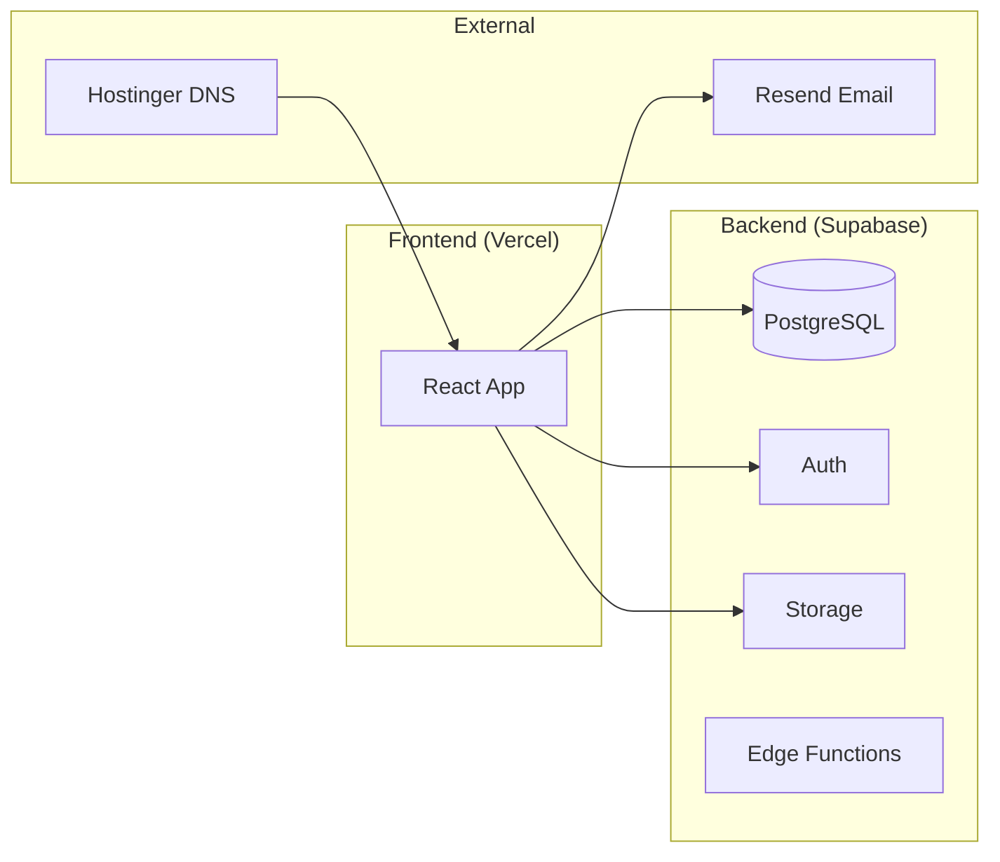

# Creasearch Marketplace - Implementation Plan v2

## Architecture Overview



| Component | Service | Region |
|-----------|---------|--------|
| Frontend | Vercel | Auto (Edge) |
| Database | Supabase PostgreSQL | Singapore |
| Auth | Supabase Auth | Singapore |
| File Storage | Supabase Storage | Singapore |
| Email | Resend | - |
| Domain/DNS | Hostinger | - |

---

## User Review Required

> [!WARNING]
> **Architecture Decision Needed**: The current codebase uses **Vite + React + Express**, but boss specs show **Next.js on Vercel**. Options:
> 1. **Keep Vite + React** – Deploy static build to Vercel, use Supabase client directly
> 2. **Migrate to Next.js** – Rewrite using Next.js App Router (significant effort ~2-3 days)
> 
> **Recommendation**: Option 1 is faster. Vite builds deploy fine to Vercel. We can add Next.js later.

---

## Database Schema (Supabase PostgreSQL)

### Core Tables

```sql
-- profiles (creators & organizations)
CREATE TABLE profiles (
  id UUID PRIMARY KEY DEFAULT gen_random_uuid(),
  user_id UUID REFERENCES auth.users(id) ON DELETE CASCADE,
  role TEXT CHECK (role IN ('creator', 'organization', 'admin')),
  name TEXT NOT NULL,
  title TEXT,
  location TEXT,
  bio TEXT,
  avatar_url TEXT,
  video_intro_url TEXT,
  collaboration_types TEXT[],
  social_links JSONB DEFAULT '{}',
  follower_total INTEGER DEFAULT 0,
  verified_socials TEXT[],
  profile_completion INTEGER DEFAULT 0,
  gigs_completed INTEGER DEFAULT 0,
  rating_score DECIMAL(3,2) DEFAULT 0,
  creasearch_score INTEGER DEFAULT 0,
  status TEXT DEFAULT 'pending' CHECK (status IN ('pending', 'approved', 'rejected')),
  created_at TIMESTAMPTZ DEFAULT NOW(),
  updated_at TIMESTAMPTZ DEFAULT NOW()
);

-- inquiries
CREATE TABLE inquiries (
  id UUID PRIMARY KEY DEFAULT gen_random_uuid(),
  from_user_id UUID REFERENCES auth.users(id),
  to_profile_id UUID REFERENCES profiles(id),
  message TEXT NOT NULL,
  collaboration_type TEXT,
  date_range TEXT,
  status TEXT DEFAULT 'new' CHECK (status IN ('new', 'in_discussion', 'accepted', 'declined')),
  created_at TIMESTAMPTZ DEFAULT NOW()
);

-- portfolio_items
CREATE TABLE portfolio_items (
  id UUID PRIMARY KEY DEFAULT gen_random_uuid(),
  profile_id UUID REFERENCES profiles(id) ON DELETE CASCADE,
  title TEXT NOT NULL,
  description TEXT,
  image_url TEXT,
  tags TEXT[],
  created_at TIMESTAMPTZ DEFAULT NOW()
);

-- reviews
CREATE TABLE reviews (
  id UUID PRIMARY KEY DEFAULT gen_random_uuid(),
  profile_id UUID REFERENCES profiles(id) ON DELETE CASCADE,
  from_user_id UUID REFERENCES auth.users(id),
  rating INTEGER CHECK (rating >= 1 AND rating <= 5),
  comment TEXT,
  created_at TIMESTAMPTZ DEFAULT NOW()
);
```

---

## Security Hardening

### 1. Row-Level Security (RLS)

```sql
-- Profiles: Public read for approved, owner write
ALTER TABLE profiles ENABLE ROW LEVEL SECURITY;

CREATE POLICY "Public profiles readable" ON profiles
  FOR SELECT USING (status = 'approved');

CREATE POLICY "Users manage own profile" ON profiles
  FOR ALL USING (auth.uid() = user_id);

CREATE POLICY "Admins manage all" ON profiles
  FOR ALL USING (
    EXISTS (SELECT 1 FROM profiles WHERE user_id = auth.uid() AND role = 'admin')
  );

-- Inquiries: Only participants can view
ALTER TABLE inquiries ENABLE ROW LEVEL SECURITY;

CREATE POLICY "Inquiry participants only" ON inquiries
  FOR SELECT USING (
    from_user_id = auth.uid() OR 
    to_profile_id IN (SELECT id FROM profiles WHERE user_id = auth.uid())
  );
```

### 2. Input Validation (Frontend + Backend)

- Zod schemas for all form inputs
- Server-side validation via Supabase Edge Functions for critical operations
- File upload validation: image (max 5MB, JPG/PNG), video (max 50MB, MP4/MOV)

### 3. Rate Limiting

- Supabase has built-in rate limiting
- Additional: 10 inquiries/hour per user (via Edge Function)

### 4. Auth Security

- **Google OAuth** (primary) — instant verification, no email confirmation needed
- Email/password as fallback option
- Password: min 8 chars, complexity check
- Session timeout: 7 days

> **Google OAuth is FREE** with Supabase. Requires:
> 1. Google Cloud project (free)
> 2. OAuth Client ID & Secret
> 3. Configure in Supabase Auth settings

### 5. Storage Security

```sql
-- Storage policies for profile-photos bucket
CREATE POLICY "Users upload own photos"
ON storage.objects FOR INSERT
WITH CHECK (bucket_id = 'profile-photos' AND auth.uid()::text = (storage.foldername(name))[1]);
```

---

## Implementation Phases

### Phase 1: Supabase Setup
- [ ] Create Supabase project (Singapore region)
- [ ] Create database tables with RLS policies
- [ ] Configure Auth (email/password + Google OAuth)
- [ ] Set up Google Cloud OAuth credentials
- [ ] Create storage buckets (`profile-photos`, `intro-videos`)
- [ ] Store keys in `.env.local`

### Phase 2: Replace Backend
- [ ] Remove Express server files (`server/` folder)
- [ ] Install `@supabase/supabase-js`
- [ ] Create Supabase client in `client/src/lib/supabase.ts`
- [ ] Update API calls to use Supabase client

### Phase 3: Auth Integration
- [ ] Create auth context with Supabase Auth
- [ ] Build login/signup modals (reuse existing UI)
- [ ] Add "Continue with Google" button (primary)
- [ ] Add email/password as fallback
- [ ] Protect routes (profile creation, admin)

### Phase 4: Connect Pages to Supabase
- [ ] `SearchPage.tsx` → query `profiles` table
- [ ] `CreatorProfilePage.tsx` → fetch by ID
- [ ] `ProfileCreationPage.tsx` → insert/update + file upload
- [ ] `AdminDashboardPage.tsx` → pending profiles, approve/reject

### Phase 5: File Uploads
- [ ] Profile photo upload to Supabase Storage
- [ ] Video intro upload (or YouTube URL validation)
- [ ] Display uploaded media in profiles

### Phase 6: Email Integration (Resend)
- [ ] Create Resend account, verify domain
- [ ] Add DNS TXT records in Hostinger
- [ ] Create Edge Function for inquiry notifications
- [ ] Send emails on: new inquiry, profile approved/rejected

### Phase 7: Deployment
- [ ] Connect repo to Vercel
- [ ] Configure environment variables
- [ ] Deploy and test on `*.vercel.app`
- [ ] Add custom domain in Vercel
- [ ] Configure DNS in Hostinger (CNAME → `cname.vercel-dns.com`)

### Phase 8: Creasearch Score
- [ ] Create Edge Function for score calculation
- [ ] Schedule bi-weekly cron (Supabase pg_cron or external)
- [ ] Score formula: `0.4×reach + 0.2×completion + 0.1×verification + 0.3×gigs`

---

## Creasearch Score Calculation

```typescript
function calculateScore(profile: Profile): number {
  const reachScore = Math.min(profile.follower_total / 1000000, 1) * 100;
  const completionScore = profile.profile_completion;
  const verificationScore = profile.verified_socials.length >= 2 ? 100 : profile.verified_socials.length * 50;
  const gigsScore = Math.min(profile.gigs_completed / 50, 1) * 100;

  return Math.round(
    0.4 * reachScore +
    0.2 * completionScore +
    0.1 * verificationScore +
    0.3 * gigsScore
  );
}
```

---

## Out of Scope (Confirmed)

- ❌ Payments / Stripe / Subscriptions
- ❌ In-app chat
- ❌ Automated scheduling
- ❌ Mobile apps

---

## Risk Mitigation

| Risk | Mitigation |
|------|------------|
| Supabase downtime | Monitor status page, consider backup strategy |
| No background jobs | Use Supabase pg_cron for score updates |
| No backup strategy | Enable Supabase daily backups (Pro plan) or manual exports |
| Social API rate limits | Cache follower counts, update weekly max |

---

## Questions for User

1. **Vite vs Next.js** – Confirm keeping current Vite + React setup?
2. **Email provider** – Resend or SendGrid preference?
3. **Social API keys** – Do you have API access for YouTube/Instagram follower counts, or use manual entry for v1?
