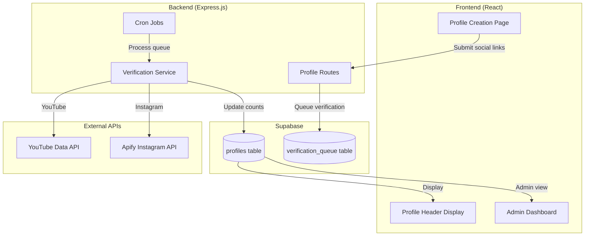

# Instagram & YouTube Verification Integration Plan

> **Last Updated**: 2026-02-01  
> **Status**: Planning  
> **Platforms**: YouTube (Official API), Instagram (Apify)

---

## Executive Summary

This plan outlines how to integrate the existing Python verification scripts (`youtube_subs.py` and `verify_followers.py`) into the Creasearch platform to automatically verify and display follower/subscriber counts for creator profiles.

---

## Current System Analysis

### Existing Python Scripts

| Script | API Used | Cost | Key Functions |
|--------|----------|------|---------------|
| `youtube_subs.py` | YouTube Data API | Free (10K units/day) | `get_subscriber_count(channel_url)` → returns `(count, status)` |
| `verify_followers.py` | Apify | $5 free/month | `verify_instagram(profile_url)` → returns `(count, status, error)` |

### Database Schema (Supabase)
```sql
-- Existing profiles table has:
social_links JSONB DEFAULT '{}'     -- Stores URLs: {youtube: "...", instagram: "..."}
verified_socials TEXT[] DEFAULT '{}' -- Stores verified platforms: ['youtube', 'instagram']
follower_total INTEGER DEFAULT 0    -- Combined followers count
```

### Backend Stack
- **Framework**: Express.js (TypeScript)
- **Routes**: `backend/src/routes.ts`
- **Services**: `backend/src/services/database.ts`

### Frontend Stack
- **Framework**: React + TypeScript + Vite
- **Components**: `ProfileHeader.tsx`, `ProfileCreationPage.tsx`
- **State**: Uses `social_links` JSONB for display

---

## Proposed Architecture



---

## YouTube (Official API – Scalable & Free)

### On Profile Submission
1. Validate channel URL format
2. Immediately fetch subscriber count (public data)
3. If subscriber count is hidden → mark as `HIDDEN`
4. Store `channel_id` and subscriber count in `social_links_verified` JSONB

### Ownership Verification (Future Phase)
- Creator clicks **"Verify YouTube"**
- Google OAuth (`youtube.readonly`)
- Compare authenticated `channelId` with submitted link
- If match → **VERIFIED_OWNER**

### Status Values
| Status | Meaning |
|--------|---------|
| `PENDING` | Link submitted, not yet verified |
| `VERIFIED` | Public data fetched successfully |
| `HIDDEN` | Subscriber count hidden by channel |
| `NOT_FOUND` | Channel doesn't exist |
| `VERIFIED_OWNER` | OAuth confirmed (future) |

### Weekly Updates
- Cron job updates subscriber counts via YouTube Data API
- Cost: 1 unit per call, safe for all creators

---

## Instagram (Apify – Quota-Limited)

### On Profile Submission
1. Save profile URL as `PENDING`
2. ❌ **No scraping on submit** (quota protection)

### Verification Pipeline (Budget-Aware)
- Daily cron processes **1–2 profiles max**
- Priority queue based on:
  - New profiles first
  - High-value profiles (more followers) second
  
### Follower Updates
- ❌ No weekly updates for all creators
- Update only **high-priority profiles**
- Frequency:
  - High priority → monthly
  - Low priority → 60–90 days
- Always show "last updated" date in UI

### Status Values
| Status | Meaning |
|--------|---------|
| `PENDING` | Queued for verification |
| `VALIDATED` | Follower count verified |
| `PRIVATE` | Account is private |
| `FAILED` | Could not fetch data |

### Quota Exhaustion Handling
- Pause Instagram verification jobs
- Platform continues working normally
- Instagram counts remain stale until quota resets
- Show "Verification pending" in UI

---

## Database Schema Updates

### New Table: `social_verifications`
```sql
CREATE TABLE IF NOT EXISTS social_verifications (
  id UUID PRIMARY KEY DEFAULT uuid_generate_v4(),
  profile_id UUID REFERENCES profiles(id) ON DELETE CASCADE,
  platform TEXT NOT NULL CHECK (platform IN ('youtube', 'instagram', 'tiktok')),
  profile_url TEXT NOT NULL,
  username TEXT,
  followers_count INTEGER,
  status TEXT NOT NULL DEFAULT 'PENDING',
  last_verified_at TIMESTAMPTZ,
  next_verification_at TIMESTAMPTZ,
  priority INTEGER DEFAULT 0,
  error_message TEXT,
  created_at TIMESTAMPTZ DEFAULT NOW(),
  updated_at TIMESTAMPTZ DEFAULT NOW(),
  UNIQUE(profile_id, platform)
);

CREATE INDEX idx_social_verifications_status ON social_verifications(status);
CREATE INDEX idx_social_verifications_next ON social_verifications(next_verification_at);
```

### Updated `social_links` Structure
```json
{
  "youtube": {
    "url": "https://youtube.com/@channel",
    "username": "channel",
    "subscribers": 150000,
    "status": "VERIFIED",
    "lastUpdated": "2026-02-01T10:00:00Z"
  },
  "instagram": {
    "url": "https://instagram.com/user",
    "username": "user",
    "followers": 50000,
    "status": "VALIDATED",
    "lastUpdated": "2026-01-15T10:00:00Z"
  }
}
```

---

## Backend Implementation

### New Files to Create

#### 1. `backend/src/services/youtube.ts`
```typescript
// TypeScript wrapper for YouTube verification
export interface YouTubeResult {
  subscribers: number | null;
  status: 'VERIFIED' | 'HIDDEN' | 'NOT_FOUND';
  channelId: string | null;
}

export async function verifyYouTubeChannel(channelUrl: string): Promise<YouTubeResult>
```

#### 2. `backend/src/services/instagram.ts`
```typescript
// TypeScript wrapper for Instagram verification (calls Python or Apify directly)
export interface InstagramResult {
  followers: number | null;
  status: 'VALIDATED' | 'PRIVATE' | 'FAILED';
  username: string | null;
}

export async function verifyInstagramProfile(profileUrl: string): Promise<InstagramResult>
```

#### 3. `backend/src/services/verification.ts`
```typescript
// Main verification orchestrator
export async function queueVerification(profileId: string, platform: string, url: string): Promise<void>
export async function processVerificationQueue(): Promise<void>
export async function getVerificationStatus(profileId: string): Promise<VerificationStatus[]>
```

### New API Routes

| Method | Endpoint | Description |
|--------|----------|-------------|
| POST | `/api/verify/youtube` | Trigger YouTube verification for a profile |
| POST | `/api/verify/instagram` | Queue Instagram verification for a profile |
| GET | `/api/profiles/:id/verifications` | Get verification status for all platforms |
| POST | `/api/admin/verify-now/:id` | Admin: Force immediate verification |

### Cron Jobs (Node.js)
```typescript
// Run every hour
cron.schedule('0 * * * *', async () => {
  await processYouTubeQueue();  // Process all pending YouTube verifications
});

// Run daily at midnight
cron.schedule('0 0 * * *', async () => {
  await processInstagramQueue(); // Process 1-2 Instagram verifications
});
```

---

## Frontend Implementation

### Profile Creation Page Updates (`ProfileCreationPage.tsx`)

1. **After Social Links Step**:
   - Show verification status indicators next to each link
   - Add "Verify Now" button for YouTube (instant)
   - Show "Verification queued" for Instagram

2. **New UI Components**:
   ```tsx
   <SocialLinkInput
     platform="youtube"
     value={formData.youtube}
     onVerify={() => verifyYouTube()}
     status={verificationStatus.youtube}
   />
   ```

### Profile Header Updates (`ProfileHeader.tsx`)

1. **Enhanced Verification Badges**:
   ```tsx
   <VerificationBadge 
     type="youtube" 
     verified={socialLinks?.youtube?.status === 'VERIFIED'}
     count={socialLinks?.youtube?.subscribers}
     lastUpdated={socialLinks?.youtube?.lastUpdated}
   />
   ```

2. **Show Real Follower Counts**:
   - Display verified counts from API instead of user-entered values
   - Add "Last updated: X days ago" tooltip

### Admin Dashboard Updates

1. **Verification Status Column**:
   - Show verification status for each social platform
   - Allow manual trigger of verification

2. **Verification Log**:
   - View history of verification attempts
   - See any error messages

---

## Confirmed Decisions

### 1. API Integration Approach
- **YouTube**: Rewrite in TypeScript (simple API calls)
- **Instagram**: Call Python scripts via `child_process.spawn()` (complex Apify integration)

### 2. Real-time vs Background Verification
- **YouTube**: Verify immediately on profile creation (blocks 2-3 seconds)
- **Instagram**: Submit first, verify in background via cron

### 3. Follower Count Display Policy
- Always show verified count (not user-entered)
- Send admin notification if difference > 20%

### 4. Existing Profile Migration
- **YouTube**: Queue for gradual verification
- **Instagram**: Skip, only verify new profiles (quota limits)

### 5. Error Handling in UI
- Show "Could not verify" with retry button
- Automatic retry after 24 hours

---

## Key Rules (Non-Negotiable)

- ❌ Never scrape Instagram on form submit
- ❌ Never update all Instagram profiles on schedule
- ✅ YouTube = scalable, Instagram = scarce resource
- ✅ Degrade gracefully, never crash system
- ✅ Always show "last updated" date for Instagram

---

## Verification Plan

### Automated Tests
1. **Unit Tests** (Jest):
   - Test YouTube URL parsing (`extract_channel_identifier`)
   - Test Instagram username extraction
   - Test verification status updates in database

2. **Integration Tests**:
   - Mock YouTube API responses
   - Mock Apify API responses
   - Test full verification flow

### Manual Verification
1. Submit a new profile with YouTube link → verify count appears within 5 seconds
2. Submit a new profile with Instagram link → verify "Pending" status shows
3. Check admin dashboard shows verification status
4. Trigger manual verification from admin panel

---

## Implementation Phases

### Phase 1: YouTube Integration (MVP)
- [ ] Create `youtube.ts` service
- [ ] Add `/api/verify/youtube` endpoint
- [ ] Update `ProfileCreationPage.tsx` to trigger verification
- [ ] Display verified counts in `ProfileHeader.tsx`

### Phase 2: Instagram Integration
- [ ] Create `instagram.ts` service (calls Python script)
- [ ] Add verification queue table
- [ ] Implement daily cron job
- [ ] Update UI to show pending status

### Phase 3: Admin Dashboard
- [ ] Add verification status column
- [ ] Add manual verify button
- [ ] Add verification history log

### Phase 4: Background Updates
- [ ] Implement weekly YouTube update cron
- [ ] Implement priority-based Instagram updates
- [ ] Add "last updated" timestamps to UI

---

## Outcome

- System survives **100+ submissions/day**
- Stays within **$5 Apify free quota**
- No misleading "verified" claims
- Ready to upgrade later with ownership proof & paid plans
